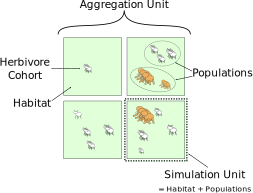
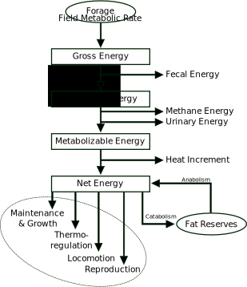

# Ecological Model Description {#page_model}
\brief Scientific background of the Modular Megafauna Model.

\tableofcontents

This document explains the design choices for the megafauna model from a scientific rather than a programmatical angle.
It also discusses the different modules in the model framework: what their assumptions are, how to use them, and how to combine them.

The first section introduces the framework of the simulation scheme.
The following four sections describe the four distinct, but interlinked conceptual elements of the modeled animal ecology.
The last section covers some lessons learned from emerging model behavior.

- Basic Model Concepts
- Energy Household
- Reproduction
- Mortality
- Effects on Environment
- Population Dynamics

Some aspects of the model can only be evaluated in the context of the connected vegetation model.
For LPJ-GUESS you will find those aspects in the megafauna doxygen page of the LPJ-GUESS repository.

## Basic Model Concepts {#sec_basic_model_concepts}

\todo
- Give a general introduction for what use case this model was originally developed. -> scientific motivation
- Limitations of the model design:
	+ habitats equal size
	+ After offspring is created no connection to parents ⇒ no lactation, bonding, herding, etc.
- Explain some design choices:
	+ Why differentiate sexes? ⇒ e.g. Shannon et al. (2013), Guthrie (1990)
	+ Why forage types?
	+ Suggest use cases for individual mode.

The world of the megafauna model is comprised of **simulation units.**
Each such unit consists of a **habitat** and the herbivore **populations** inhabiting it.
The habitat must be implemented by the outside vegetation model.
Each herbivore cohort (or individual) is assigned a **herbivore functional type (HFT),** the herbivore species so to say.
An HFT is simply a user-defined, constant set of parameters defining physiology, life history, and everything else.
Each population contains all herbivores of one HFT in a particular habitat.

Herbivores can be simulated as cohorts or as individuals.
In cohort mode, all herbivores of one annual age class have the same state variables.
In individual mode, each individual herbivore has its own state.
These are the state variables for each herbivore object:

- Age
- Sex
- Current energy need
- Fat mass

The simulations run with daily time steps. The predecessor model by Adrian
Pachzelt \cite pachzelt2013coupling operated on a monthly schedule and was thus
much faster. However, the Modular Megafauna Model should be applicable on
different spatial and temporal scales. LPJ-GUESS simulates vegetation in a
daily schedule, and so naturally the attached herbivores should be treated the
same. Moreover, there has been no formal analysis how much a coarser temporal
resolution affects the model outcome. So it seemed better to air on the side of
a finer resolution.

Offspring of large herbivores usually shows an even sex ratio. Most model
processes don’t differentiate between males and females, only body size and age
of maturity have sex-specific parameters. It seems important to at least set
the basis for gender differentiation because some large herbivores do show
pronounced sexual dimorphism not only in size (e.g. bison or proboscideans) but
also in diet and behavior (e.g. elephants: \cite shannon2013diet).

### Body Mass and Composition {#sec_body_mass_and_composition}
Calder (1996, p. 14) \cite calder1996function:

> Should the total body mass used in allometry include gut contents, a major
> source of variability (but representing mass that the animal must be designed
> to support and carry), or should gut contents be subtracted from live mass?
> Disallowing gut contents is not practical in studies wherein the animals are
> not, or should not be sacrificed.

In this line of argument, the gut contents are always included the body mass
values given in the megafauna model. It is designed for large herbivores, in
particular extinct ones, and their body mass is most commonly given as a total
live weight.

The variable amount of body fat, which serves as energy reserves, is a critical
component of the herbivore simulations. As Blaxter (1989, p. 51)
\cite blaxter1989energy explains, the ingesta-free animal body can be viewed as
composed of fat and fat-free mass:

> Schematically the body can be regarded as consisting of two components – fat
> and non-fat. […] The non-fat material consists of water, the minerals of bone
> and soft tissue, carbohydrate, nitrogen-containing compounds, and, in the
> living animal, the contents of the digestive tract. The non-fat component of
> the body is usually referred to as the *lean body mass* or *fat-free mass.*
> Many studies, commencing with those of Murray (1922) and embracing a wide
> range of adult species, have shown that the chemical composition of the
> fat-free body is approximately constant. The wide range of composition of
> animals is largely, but not entirely, due to variation in the proportion of
> fat.

So the user-defined live body mass of simulated herbivores is the sum of blood,
gut contents (ingesta), structural (fat-free) mass and deposited body fat. It
is very important to realize that the body fat that the model works with is
pure lipids. This total lipid content of animal tissue is also known as ether
extract, free lipid content, or crude fat (Hyvönen, 1996
\cite hyvonen1996approach). This is different from the mass of suet and organ
fat because the fat tissue also contains water.

When defining the fractional body fat parameter for an herbivore, you should
not rely on measurements of weight loss of starving or fattening animals. In
such data it is difficult to disentangle the contributions of changing fat
mass, gut contents, water content, and fat-free mass (e.g. Reimers et al., 1982
\cite reimers1982body).

\todo
- What fraction is the structural body mass of live weight?
    - @reimers1982body observe in starved (i.e. ± fat-free) reindeer carcasses
      that the structural body mass (no fat, no ingesta, no blood, no antlers)
      is around 80% of live weight (Tab. 2). On average the gut contents were
      21.7 ± 4.6% of total body weight, which is higher than in roe deer
      (12.7%) and white-tailed deer (9.7%) (p. 1818).
- Why do we not consider protein as an energy reserve?
    - Reimers et al. (1982, pp. 1813, 1819) observe that about 31% of the body
      protein was lost during winter.
    - Parker et al. (1993) observed that Sitka black-tailed deer lost 10–15% of
      their protein reserves during winter.
- What does the growth curve look like?
    - Compare @price1985growth [pp. 187-190] and @blaxter1989energy
      [p. 242-244].

### Life History {#sec_life_history}

\todo Explain how growth is linear in \ref Fauna::HerbivoreBase::get_bodymass()

Blaxter (1989)\cite blaxter1989energy, p. 242f:

> Growth in weight is characteristically sigmoid; it accelerates during a short
> initial period and then declines until, as maturity approaches, it approaches
> zero. A large number of different functions have been used to describe this
> relationship between weight and time. Virtually all of them state that dW/dt,
> the rate of change in weight with time (or *rate of growth*) is a function of
> weight at the time that dW/dt is measured. Such functions include the
> logistic equation, the Gompertz function and the Bertalanffy function. These
> are derived algebraically in most textbooks of biomathematics (see Causto
> 1977). They were generalised by F.J. Richards (1959) and have been reviewed
> and critically analysed by Parts (1982).

## Energy Household {#sec_energy_household}

### Energy Content of Forage {#sec_energy_content}

The model for energy content in herbivore forage presented here is based on the
partitioning of metabolizable energy. A historical overview of the model
framework is given by Ferrell & Oltjen (2008) \cite ferrell2008asas. Its
conceptual shortcomings and difficulties in practical methodology are
summarized by Birkett & de Lange (2001) \cite birkett2001limitations.

The diagram on the energy household shows how energy from the forage is used by
an herbivore: **Gross energy** (GE) is the heat that could be produced from
complete combustion of the feedstuff. From that, the part which is not excreted
in feces is the **digestible energy** (DE). Some proportion of it is then lost
to urine and gas production, but the rest is **metabolizable energy** (ME).
After deducing now the losses due to heat increment, the remaining **net
energy** (NE) is effectively utilizable for all physiological processes.

Gross energy depends only on the physical properties of the forage and measured
in a combustion chamber. It is therefore independent of the animal. McDonald et
al. (2010, p. 259)\cite mcdonald2010animal provide an overview of gross energy
in different feedstuffs for livestock: It typically ranges between 18 to 20
MJ/kgDM. The measurements by Golley (1961) \cite golley1961energy suggest that
there is some seasonal variation in gross energy of leaves. However, the model
assumes a constant value.

The proportional **dry-matter digestibility** (DMD) of the forage is a central
variable in the model. It measures the fraction of the gross energy that is
usable by the animal. The rest gets excreted in the feces because it is
undigestible fiber: protected cellulose and hemicellulose, silica, and cutin.
Agricultural research has shown that the digestibility is closely correlated
with metabolizable energy and net energy (Minson, 1990, p. 7
\cite minson1990forage). Therefore digestibility is modeled as the *one*
indicator for forage quality, i.e. forage energy density, and must be given by
the vegetation model. This neglects any other effects on the digestibility,
like interactions of different forages or effects of the individual animal on
the digestibility. Digestibility is best measured *in vivo* in the rumen of a
living ruminant, but there exist various indirect methods with reliable
conversions. For an overview see Minson (1990) \cite minson1990forage and
McDonald (2010) \cite mcdonald2010animal. Formulas in the megafauna model
assume *in vivo* digestibility.

Research has focused mainly on the digestion of ruminant livestock, and so the
megafauna model works primarily with the well-established formulas for
ruminants. Digestibility is also defined for ruminants. To account for the less
efficient digestion of hindgut fermenters, the user can define a
**digestibility multiplier** to convert ruminant digestibility to hindgut
digestibility. This approach is taken from by  and Pachzelt et al. (2015)
\cite pachzelt2015potential, who cite Illius & Gordon (1992)
\cite illius1992modelling

Ruminants typically lose a relatively constant fraction of about 19% of
digestible energy in urine and methane (López et al. 2000
\cite lopez2000prediction, McDonald et al. 2010 \cite mcdonald2010animal,
p. 258). The difference between cattle and sheep is very small here (McDonald
et al. 2010, p. 260). McDonald et al. (2010, p. 258) specify that 11–13 percent
of digestible energy is lost as methane. The 19% loss to urine and gases is
often expressed as the ratio of metabolizable energy to digestible energy,
ME/DE=0.81. This ratio is also known as the **metabolizable energy
coefficient** (e.g. in Robbins, 1983\cite robbins1983wildlife).With a gross
energy of about 19 MJ/kg, metabolizable energy in the digestible fraction of
the forage is then about 15–16 MJ/kg. Various herbivore models work with these
numbers, for instance: Givens et al. (1989)\cite givens1989digestibility,
Illius and Gorden (1991)\cite illius1991prediction, Parker et al. (1991)
\cite parker1996foraging, Illius and Gordon (1999)\cite illius1999scaling,
Smallegange and Brinsting (2002)\cite smallegange2002food.

\warning Some publication, like Minson (1990)\cite minson1990forage, use the
term “metabolizability of energy” or “metabolizable energy coefficient” to
refer to the ME/GE ratio: the metabolizable fraction of the *gross* energy.
This includes fecal losses and has the dry-matter digestibility already
calculated in. However, the modular megafauna model works with explicit
digestibility values and the ME/DE ratio. You could divide the ME/GE ratio by
the fractional digestibility to get ME/DE.

A unitless **net energy coefficient** (k) defines the efficiency of using the
metabolizable energy for meeting maintenance energy needs, i.e. for converting
metabolizable energy content to **net energy** content (NE) of the forage. (In
Robbins (1983)\cite robbins1983wildlife it is called *NEC*.) Many livestock
models differentiate between different k values to reflect different conversion
efficiencies: for meeting maintenance needs (km), for growth and
fattening (kf), and for lactation (kl) (Blaxter 1989,
p. 254ff\cite blaxter1989energy; Minson 1990\cite minson1990forage, p. 151).

In the Modular Megafauna Model, the energy budget calculates with the
“currency” net energy. Basal and field metabolic rate and other energy
expenditures are directly “paid” with net energy. Therefore the efficiency
factor km is used to convert from metabolizable energy to net
energy. Body fat is anabolized from metabolizable forage energy with the
efficiency factor kf.

Catabolized fat reserves are directly available as net energy to balance any
energy “debts” on a daily basis. Like in Illius & O’Connor (2000)
\cite illius2000resource, the combustion (gross) energy of fat tissue is used
to convert from mass to energy. That is, we assume 100% conversion efficiency
from body fat to net energy.

Feeding trials have shown that the net energy coefficient can linearly depend
on the metabolizable energy content of the forage (Robbins, 1983, p. 296f;
Minson, 1990, p. 93, 155). However, this effect seems to be mostly related to
very high levels of feeding and by pelleting the feed. In this model, the
energy coefficients km and kf are assumed to be constant.

\remark
Internally the model converts first from metabolizable energy to net energy to
pay energy expenditures. If there is excess net energy, this gets converted
*afterwards* to body fat. The amount of net energy required to build up one
kilogram of body fat is given by the product of fat gross energy content,
km and kf⁻¹. Note that Illius & O’Connor (2000)
\cite illius2000resource probably took the same approach when they specify an
anabolism coefficient of 54.6 MJ/kg, citing Blaxter (1989)
\cite blaxter1989energy. Namely, 54.6 MJ/kg is the product of 39 MJ/kg,
km=0.70, and the inverse of kf=0.50; probably Illius &
O’Connor (2000) took the latter two figures from Table 12.1 on page 259 in
Blaxter (1989) for oxen on an “average diet.”

In summary: Net energy content, NE in MJ/kgDM, depends on variable dry-matter
digestibility, DMD, as the key variable. Gross energy content, GE, is
user-specified for each forage type. Only the digestible fraction of the gross
energy in dry matter is counted as digestible energy, DE. How much
metabolizable energy can be extracted from the digested part of the forage is
species-specific and defined by the user as the metabolizable energy
coefficient or ME/DE ratio. A user-defined factor, km, defines how
efficient the metabolizable energy is used to meet net energy needs for
maintenance and other activities. The factor kf denotes the
efficiency for converting from ME to body fat (anabolism), but burning of fat
reserves happens without energy loss. The net energy content is given by:

NE = ME * km = DE * ME/DE * km = GE * DMD * ME/DE * km

### Thermoregulation by Conductance {#sec_thermoregulation}

This model of thermoregulation is often called the **Scholander-Irving model**
and was published in two seminal papers in 1950:
\cite scholander1950adaptation \cite scholander1950heat. The more detailed
implementation is taken from Peters (1983) \cite peters1983ecological.

Homeothermic animals have extra energy costs to maintain their body core
temperature. Through basal metabolism and other ways of energy burning, heat is
already passively created. Thermoregulatory costs arise when the ambient
temperature drops below the *lower critical temperature*: the passive heat from
thermoneutral metabolism is not counterbalance heat loss to the environment.
The rate of heat loss depends on the *thermal conductance* of the whole animal
(energy flow per temperature difference), which in turn depends on the *thermal
conductivity* (energy flow per temperature difference and per thickness) of fur
and skin and the body surface. Conductance is the inverse of resistance or
insulation, and conductivity is the inverse of resistivity.

- Tcrit: Lower critical temperature [°C].
- Tcore: Body core temperature [°C].
- Tair: Ambient air temperature [°C].
- Eneu: Thermoneutral metabolic rate [MJ/ind/day]
- C: Whole-body thermal conductance [W/ind].
- Φ: Heat loss [MJ/ind/day]

Tcrit = Tcore - Eneu / C

Φ = C * max(Tcrit - Tair, 0)

\note In its current form, the model only considers costs when temperatures are too low.
Overheating effects are not implemented since the model was developed with the focus on Arctic megafauna.

#### Conductance

The critical parameter for thermoregulatory expenditure is the (whole-body) conductance: the rate of heat flow per difference between core and air temperature (W/°C).
The conductance can be approximated from the average conductivity and the body surface.
Conductivity is the inverse of insulation: it is the heat flow per temperature difference per area.

Body surface in m² scales roughly as \f$0.09*M^{0.66}\f$ ([Hudson & White 1985](\cite hudson1985bioenergetics)).

### Foraging {#sec_foraging}

\note **Units**
- All forage values (e.g. available grass biomass, consumed forage) are *dry matter mass* in kilograms (`DMkg`).
- Any forage per area (e.g. forage in a habitat) is `kgDM/km²`.
- Herbivore-related mass values (e.g. body mass, fat mass) are also `kg`, but live mass.
- Population densities of herbivores are either in `kg/km²` or `ind/km²` (ind=individuals).
- Digestibility values are interpreted as in-vitro digestibility.

\todo Find a reference for this definition of in-vitro digestibility.

@startuml "Levels of herbivore intake constraints. What and how much of the available forage an herbivore ingests is limited by a cascade of internal and external factors."
	!include diagrams.iuml!intake_limit_levels
@enduml

\todo
- What is the problem with β (half-max intake density) in Illius & O’Connor (2000) and Pachzelt et al.?

## Reproduction {#sec_reproduction}

## Mortality {#sec_mortality}

## Effects on Environment {#sec_effects_on_environment}

### Nitrogen Cycling {#sec_nitrogen_cycling}
The vegetation model defines the nitrogen content in forage.
The maximum amount of nitrogen (\f$N_{bound}\f$, kgN/km²) bound in herbivores is comprised of the body tissue and the contents of the digestive tract.
Any ingested nitrogen is added to the pool of herbivore-bound nitrogen, and the surplus is returned to the vegetation model, which should make it available to plants again.

The amount of nitrogen bound in body tissue is approximated with 3% of live body weight (Robbins 1983\cite robbins1983wildlife); this ignores variation in fat and structural mass.
Upon death, this amount of nitrogen is also returned to the vegetation model.

The nitrogen of ingesta in stomach and intestines depends on the mean retention time (\f$MRT\f$, hours) and the day’s intake of nitrogen (\f$I_N\f$, kgN/ind/day).

\f[
  N_{bound} = N_{guts} + N_{body} = I_N * MRT * P + 0.03 * M * P
\f]

\f$P\f$ is the population density (ind/km²) and \f$M\f$ is the body mass (kg/ind).
Mean retention time in hours is calculated according to Clauss et al. (2007)\cite clauss2007case, Fig. 2:

\f[
  MRT = 32.8 * M^{0.07}
\f]

## Population Dynamics {#sec_population_dynamics}
\todo
- Explain the drama of population fluctuations:
	+ What makes populations crash to zero?
	+ What’s the problem with annual allocation?
	+ What mechanisms have we explored to prevent population crashes?

### Minimum Density Threshold {#sec_minimum_density_threshold}
The parameter \ref Fauna::Hft::mortality_minimum_density_threshold defines at which point a dwindling population (sum of all cohorts/individuals) may be considered dead.
It is an arbitrary, but critical value for model performance.
Possible re-establishment only happens if all cohorts are dead within one habitat.

It is important to keep this parameter low enough for slow-breeding and long-lived animals because otherwise they may die out after establishment:
After establishment, the background mortality continually diminishes the adult cohorts, and after some years the total population (all cohorts together) my drop below the `minimum_density_threshold` before reproduction could compensate.

On the other hand, the `minimum_density_threshold` should not be set *too* low as this would result in extremely thin “ghost” populations that are effectively preventing re-establishment.

### Species Coexistence {#sec_coexistence}

The classical competitive exclusion principle predicts that no two species can coexist in the long term if they each solely depend on one shared resource (\cite hardin1960competitive).
One species will inevitably outcompete the other one.
Though there are indeed ecological mechanisms that can facilitate coexistence with a shared resource (\cite chesson2000mechanisms), the parameter space for this to happen in a model is usually very narrow (e.g. \cite vanlangevelde2008intantaneous).

In order to simply avoid competition among different HFTs, the option `one_hft_per_habitat` can be enabled: Each HFT exists on its own, without any interaction with other species.
With that option enabled, all HFTs should each be assigned to the same number of habitats.
It is the responsibility of the host application (the vegetation model) to ensure that the number of habitats is an integer multiple of the HFT count.

---

\author Wolfgang Traylor, Senckenberg BiK-F
\date 2019
\copyright ...
