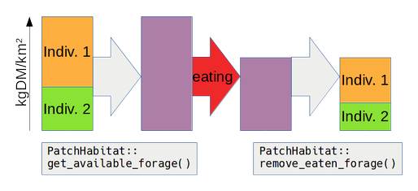

Software Design of the Herbivory Module {#page_herbiv_design}
=============================================================
<!-- For doxygen, this is the *page* header -->
\brief Notes on the software design of the LPJ-GUESS herbivory module from a programmer’s perspective.

Software Design of the Herbivory Module {#sec_herbiv_design}
============================================================
<!-- For doxygen, this is the *section* header -->
\tableofcontents

Overview {#sec_herbiv_designoverview}
-------------------------------------

The herbivory module differs in its design from the main LPJ-GUESS code in that it aims to apply principles of [object oriented programming](\ref page_object_orientation) as much as possible.
Its architecture is modular so that different parts can be tested in [unit tests](\ref page_herbiv_tests).
This entails that *most* of the code of the herbivory module does not depend on LPJ-GUESS code (compare the section \ref sec_herbiv_reusing_code).

The following UML diagram shows through which interfaces the herbivory module interacts with other components:
- \ref Fauna::PatchHabitat
- \ref Fauna::ParamReader
- \ref GuessOutput::HerbivoryOutput

@startuml "Component diagram of the basic interactions of the herbivory module."
	!include herbiv_diagrams.iuml!basic_components
@enduml

The basic simulation design is simple:
- Each **herbivore** is of one **Herbivore Functional Type** ([HFT](\ref Fauna::Hft)).
In LPJ-GUESS this would correspond to each \ref Individual being of one Plant Functional Type ([PFT](\ref Pft)).
- Each herbivore lives in a **habitat** (\ref Fauna::Habitat), grouped in by HFT in **populations** (\ref Fauna::PopulationInterface).
In LPJ-GUESS this would correspond to a plant \ref Individual growing in a \ref Patch.
(Note that the herbivory module is completely ignorant of [gridcells](\ref Gridcell) and [stands](\ref Stand)).
- The **[Simulator](\ref Fauna::Simulator)** is the %framework running the simulation.

@startuml "Most important classes in the herbivory module."
	!include herbiv_diagrams.iuml!important_classes
@enduml

All interactions between herbivores and their environment happen through \ref Fauna::Habitat.
The herbivores don’t feed themselves and don’t have any direct connection to the habitat.
With each simulated day ([simulate_day()](\ref Fauna::HerbivoreInterface::simulate_day())), it is calculated, how much forage they would like to consume. ([get_forage_demands()](\ref Fauna::HerbivoreInterface::get_forage_demands()));
but they need to wait for the Simulator to be able to [eat](\ref Fauna::HerbivoreInterface::eat()).
This approach follows the [Inversion of Control Principle](\ref sec_inversion_of_control).

Similarly, the Habitat does not interact with the herbivores either.
It does not even *know* about the herbivore populations, as it is capsuled in \ref Fauna::SimulationUnit.

### Integration with the LPJ-GUESS Vegetation Model {#sec_herbiv_lpjguess_integration}

The class \ref Fauna::PatchHabitat is the central class ([facade](\ref sec_facade)) for any interactions between the herbivory module and the LPJ-GUESS vegetation model.
The life of any PatchHabitat object and its associated herbivores (encapsuled in \ref Fauna::SimulationUnit) depends on the owning Patch object.
However, the habitat and its herbivores should *not* be manipulated by the vegetation model!

Some new plant properties had to be introduced.
- They are only herbivory-specific. 
- They potentially depend on global herbivory simulation settings (\ref Fauna::Parameters).
- They form one logical unit.

For these reasons, they were not simply added to the class \ref Pft, but they are gathered in \ref Fauna::PftParams.
For the same reasons, they are also parsed by \ref Fauna::ParamReader (see \ref sec_herbiv_parameters).

@startuml "Class diagram around Fauna::PatchHabitat."
	!include herbiv_diagrams.iuml!patchhabitat_interactions
@enduml

In order to minimize dependencies, PatchHabitat objects are not created by the class \ref Patch, but by the function \ref framework(), as this diagram shows:

@startuml "Sequence diagram of how Fauna::PatchHabitat is constructed."
	!include herbiv_diagrams.iuml!patchhabitat_construction
@enduml

#### Forage Removal {#sec_herbiv_forageremoval}

Herbivores remove aboveground plant biomass: They reduce \ref Individual::cmass_leaf and \ref Individual::nmass_leaf.
This is implemented in the function \ref Individual::reduce_biomass().

Several \ref Individual objects can be of the same forage type and appear to the herbivore as one single quantity, which is then reduced by eating.
\ref Fauna::PatchHabitat::get_available_forage() calls \ref Individual::get_forage_mass() and sums up the quantities (kgDM/km²) for each forage type.
\ref Fauna::PatchHabitat::remove_eaten_forage() converts the absolute eaten forage (kgDM/km²) into a fraction of remaining forage, which is then passed to \ref Individual::reduce_forage_mass().
All this works only on the “available” part of the aboveground biomass (see \ref Fauna::PftParams::inaccessible_forage).

Eaten carbon leaves the system completely and is registered as a flux to the atmosphere (\ref Fluxes::EATENC).
Eaten nitrogen is also registered as a flux (\ref Fluxes::EATENN), but returned to the soil pool \ref Soil::nmass_avail (\ref Fluxes::EXCRETEDN).

Even though the nitrogen cycle is closed anyway, is important to have both ingestion and egestion nitrogen fluxes because the \ref MassBalance object would throw error messages otherwise since it is operating on an annual cycle while the herbivory module has a daily scheme.

\see \ref sec_herbiv_nitrogen_excretion

#### Abiotic Environment {#sec_herbiv_abiotic_environment}

The container \ref Fauna::HabitatEnvironment contains informationen about the current abiotic conditions in a habitat. The are constant within the habitat and for one day.

**Snow:** LPJ-GUESS calculates snow pack as snow water equivalent (\ref Soil::snowpack).
The herbivory module needs the effective depth of the snow that is covering the ground.
A “snow depth model” translates snow water equivalent to snow depth.
New algorithms for snow density can also be implemented: \ref sec_herbiv_new_snow_depth_model.

Forage Classes {#sec_herbiv_forageclasses}
------------------------------------------

The model is designed to make implementation of multiple types of forage (like grass, browse, moss, etc.) easy.
Each forage type is listed in \ref Fauna::ForageType.
The global constant \ref Fauna::FORAGE_TYPES holds all entries of this enum.

The template class \ref Fauna::ForageValues serves as a multi-purpose container for any forage-specific values.
Many arithmetic operators are defined to perform calculations over all forage types at once.
For any specific use of the class, a typedef is defined, e.g. \ref Fauna::ForageMass or \ref Fauna::Digestibility.
This helps to directly see in the code what a variable contains.

Forage types need to have specific model properties.
Grass, for instance, has the property *sward density,* which would not make sense for leaves of trees.
Therefore, a second set of forage classes is defined with one class for each forage type.
All these classes inherit from \ref Fauna::ForageBase.

Any type-specific properties are defined by \ref Fauna::Habitat::get_available_forage().
They can be used for example in algorithms of 
[forage distribution](\ref Fauna::DistributeForage),
[diet composition](\ref Fauna::GetForageDemands::get_diet_composition),
[digestion limits](\ref Fauna::GetForageDemands::get_max_digestion), or
[foraging limits](\ref Fauna::GetForageDemands::get_max_foraging).

@startuml "Forage classes in the herbivory module."
	!include herbiv_diagrams.iuml!forage_classes
@enduml

\see \ref sec_herbiv_new_forage_type

The Herbivore {#sec_herbiv_herbivoredesign}
-------------------------------------------

The simulation framework of the herbivory module can operate with any class that implements \ref Fauna::HerbivoreInterface (\ref sec_liskov_substitution).
Which class to choose is defined by \ref Fauna::Parameters::herbivore_type.

Currently, two classes, \ref Fauna::HerbivoreIndividual and \ref Fauna::HerbivoreCohort, are implemented.
Their common model mechanics are defined in their abstract parent class, \ref Fauna::HerbivoreBase (see below).
The herbivore model performs calculations generally *per area.*
That’s why individual herbivores can only be simulated if an absolute habitat area size is defined.<!--TODO: Where is it defined-->

@startuml "Class diagram of the two default herbivore classes (for individual and cohort mode), which share the same model mechanics defined in Fauna::HerbivoreBase."
	!include herbiv_diagrams.iuml!herbivore_classes
@enduml

\see \ref sec_herbiv_new_herbivore_class

### HerbivoreBase {#sec_herbiv_herbivorebase} ### 
The herbivore class itself can be seen as a mere framework (compare \ref sec_inversion_of_control) that integrates various compartments:
- The herbivore’s own **energy budget**: \ref Fauna::FatmassEnergyBudget.
- Its **energy needs**, defined by \ref Fauna::Hft::expenditure_components.
The herbivore is self-responsible to call the implementation of the given expenditure models.
(A strategy pattern would not work here as different expenditure models need to know different variables.)
- How much the herbivore **is able to digest** is limited by a single algorithm defined in \ref Fauna::Hft::digestive_limit.
- How much the herbivore **is able to forage** can be constrained by various factors which are defined as a set of \ref Fauna::Hft::foraging_limits.
- The **diet composition** (i.e. feeding preferences in a scenario with multiple forage types) is controlled by a the model selected in \ref Fauna::Hft::diet_composer, whose implementation may be called in \ref Fauna::GetForageDemands::get_diet_composition().
- How much **net energy** the herbivore is able to gain from feeding on forage is calculated by an implementation of \ref Fauna::GetNetEnergyContentInterface 
([constructor injection](\ref sec_inversion_of_control)).
- **Death** of herbivores is controlled by a set of \ref Fauna::Hft::mortality_factors. 
For a cohort that means that the density is proportionally reduced, for an individual, death is a stochastic event.
The corresponding population objects will release dead herbivore objects automatically.

@startuml "Model compartments around Fauna::HerbivoreBase."
	!include herbiv_diagrams.iuml!herbivorebase_compartments
@enduml

### Populations {#sec_herbiv_populations} ### 
Each herbivore class needs a specific population class, implementing \ref Fauna::PopulationInterface, which manages a list of class instances of the same HFT.
Each [habitat](\ref Fauna::Habitat) is populated by herbivores.
The class \ref Fauna::SimulationUnit a habitat and its herbivores (managed by HFT in \ref Fauna::HftPopulationsMap).

@startuml "Herbivore population classes."
	!include herbiv_diagrams.iuml!population_classes
@enduml

Error Handling {#sec_herbiv_errorhandling}
------------------------------------------

### Exceptions ### {#sec_herbiv_exceptions}
The herbivory module uses the C++ standard library exceptions defined in `<stdexcept>`.
All exceptions are derived from `std::exception`:
@startuml "Standard library exceptions used in the herbivory module."
	!include herbiv_diagrams.iuml!exception_classes
@enduml

Any function that potentially *creates* an exception declares that in its doxygen description.
Beware that any function—unless documented otherwise—will not catch exceptions from calls to other functions.
Therefore, even if a function does not announce a potential exception throw in its documentation, it will pass on any exceptions from other functions which it calls.

Exceptions are used…:
- …to check if parameters in public methods are valid.
- …to check the validity of variables coming from outside of the herbivory module where there are no contracts defined and ensured.

Each class makes no assumptions about the simulation framework (e.g. that parameters have been checked), but solely relies on the class contracts in the code documentation.

Exceptions are caught with `try{…}catch(…){…}` blocks in:
- framework.cpp: function \ref framework()
- herbiv_testsimulation.h: %main() function and \ref FaunaSim::Framework::run()

\note No part of the herbivory module writes directly to the shell output (stdout/stderr), except for:
- FaunaSim::Framework
- Fauna::ParamReader

\remark
If you debug with [`gdb`](https://www.gnu.org/software/gdb) and want to backtrace an exception, use the command `catch throw`.
That forces gdb to stop at an exception, and then you can use the command `backtrace` to see the function stack.

### Assertions ### {#sec_herbiv_assertions}
At appropriate places, `assert()` is called (defined in the standard library header `<cassert>`/`assert.h`).
`assert()` calls are only expanded by the compiler if compilation happens for DEBUG mode; in RELEASE, they are completely ignored.

Assertions are used…: 
- …within non-public methods to check within-class functionality.
- …to verify the result of an algorithm within a function.
- …in code regions that might be expanded later: An assert call serves as a reminder for the developer to implement all necessary dependencies.

Herbivory Parameters {#sec_herbiv_parameters}
---------------------------------------------

The herbivory module uses the same instruction files and plib 
(\ref plib.h) functionality as the vegetation model.
In order to separate concerns, all herbivory-related parameters
are declared and checked in the class \ref Fauna::Parameters, but parsed by the class \ref Fauna::ParamReader.
ParamReader is the only one being directly dependent on \ref parameters.h and \ref plib.h (apart from \ref FaunaSim::Framework and \ref GuessOutput::HerbivoryOutput).

The principle that parameter member variables put in one class, which also knows to check their validity, but parsed in ParamReader, is also applied in \ref Fauna::Hft and \ref Fauna::PftParams.

@startuml "Interactions of parameter-related classes in the herbivory module." 
	!include herbiv_diagrams.iuml!parameters_classes
@enduml

\note The implementation can be called a rather dirty fix around the inflexible design of LPJ-GUESS parameter library. 
Some global constants (checkback and block codes) and global pointers from \ref parameters.h and \ref parameters.cpp are used in \ref herbiv_parameters.cpp.

An example instruction file is provided in 
`data/ins/herbivores.ins`:
\snippet herbivores.ins Example Herbivore
\see \ref sec_herbiv_new_hft_parameter
\see \ref sec_herbiv_new_pft_parameter
\see \ref sec_herbiv_new_global_parameter

Following the [Inversion of Control](\ref sec_inversion_of_control) principle, as few classes as possible have direct access to the classes that hold the parameters (\ref Fauna::Hft, \ref Fauna::Parameters, \ref Fauna::PftParams).
These classes play the role of the “framework” by calling any client classes only with the very necessary parameters.
The following diagram gives an overview:

@startuml "Classes of the herbivory simulation which have direct access to parameter-holding classes."
	!include herbiv_diagrams.iuml!parameters_access
@enduml

\bug When printing out the help with \ref plibhelp() 
(by running `guess -help`), the global parameters declared in 
\ref Fauna::ParamReader::declare_parameters() under 
`BLOCK_GLOBAL` appear out of order in the output.

Herbivory Output {#sec_herbiv_output}
-------------------------------------

The herbivory module uses the existing LPJ-GUESS API for output.
This brings some limitations:
1. The output module needs to be singleton.
2. The columns of the tables need to be defined in advance.
That demands a globally defined HFT list.
3. The tables allow only `double` values, no strings.
That means that for each “measured” output variable (e.g. `individual density`) *one* table needs be created; the “fixed” variable (in this case `HFT`) has its values in the column. 
“Tidy data” output (*sensu* Wickham, 2014\cite wickham_tidy_2014), with variables in columns and observations in rows, is therefore not possible.
4. That means that combining multiple fixed variables (e.g. `ForageType` and `HFT`) leads to bulky column names (“grass_hft1”, “grass_hft2”, “browse_hft1”, etc.), which need to be separated in post-processing software.

### Output Classes {#sec_herbiv_outputclasses}

Output classes within the herbivory module are collected in the namespace \ref FaunaOut.
- The two structs \ref FaunaOut::HabitatData and \ref FaunaOut::HerbivoreData are simple data containers.
- The struct \ref FaunaOut::CombinedData represents one datapoint (‘tupel’/‘observation’) of all output variables in space and time.

@startuml "Output classes of the herbivory module."
	!include herbiv_diagrams.iuml!outputclasses
@enduml

There are three levels of data aggregation:

1) Each day in \ref Simulator::simulate_day(), a new datapoint (\ref FaunaOut::CombinedData) is created for each simulation unit.
For this, the habitat data is taken as is, but the herbivore data is aggregated per HFT (see \ref FaunaOut::HerbivoreData::create_datapoint()).
This level of aggregation is **spatial within one habitat**.
Here, any variables *per habitat* or *per area* are summed, for instance herbivore densities.
Variables *per individual* are averaged, using individual density as weight.

2) The second level of aggregation happens also in \ref Simulator::simulate_day().
The datapoint for that day is added to the temporal average in the \ref Fauna::SimulationUnit object.
This level of aggregation is therefore **temporal across days**.

3) The third level of aggregation takes place in \ref GuessOutput::OutputModule.
Here, the accumulated temporal averages from the simulation units are combined in spatial units, i.e. [gridcells](\ref Gridcell).
This level of aggregation is therefore **spatial across habitats**.

The latter two aggregation levels are performed by \ref FaunaOut::CombinedData::merge().

Note that all time-dependent variables are always **per day.**
For example, there is no such thing like *forage eaten in one year.*
This way, all variables can be aggregated using the same algorithm, whether they are time-independent (like *individual density*) or represent a time-dependent rate (like *mortality* or *eaten forage*).

#### Pros and Cons of the Output Design {#sec_herbiv_output_prosandcons}

The pros of this design:
- Simplicity: Only few, easy-to-understand classes.
- Separation of concerns: Each class (herbivores and habitats) is self-responsible for managing its own output, and the output data containers are self-responsible for aggregating their data.
- Diversity of data structures: There is no restriction in regards to data type for new member variables in the output containers (as long as they can be merged).

The cons of this design:
- Strong coupling: The output module is highly dependent on the data structure of the output containers.
- Multiple responsibilities: \ref GuessOutput::HerbivoryOutput is a monolithic class, violating the [Single Responsibility Principle](\ref sec_single_responsibility).
- Rigidity of data containers: Ideally, the containers should be oblivious to the details of the data they hold.
- Lack of modularity: A submodule of, e.g. HerbivoreBase cannot easiliy deliver its own output variable.
- Cumbersome extensibility: New output variables need to be introduced in various places (see \ref sec_herbiv_new_output).
That is a violation of the [Open/Closed Principle](\ref sec_open_closed).
- Any variable that is specific to a submodule or interface implementation (e.g. `bodyfat` is specific to HerbivoreBase) will produce undefined values if that submodule is not active.
The user is then responsible to interpret them as invalid or disable their output.
So far, there is no check of congruency between [parameters](\ref Fauna::Parameters)/[HFT settings](\ref Fauna::Hft) and the selection of output variables in the output module.

### Output Module {#sec_herbiv_outputmodule}

The new output module \ref GuessOutput::HerbivoryOutput is 
derived from the abstract class \ref GuessOutput::OutputModule.
The following diagram shows how it interacts with the LPJ-GUESS output framework and the herbivory module. 
<!--TODO: diagram-->
@startuml "Class diagram of the connections around class GuessOutput::HerbivoryOutput."
	!include herbiv_diagrams.iuml!outputmodule_class
@enduml

The following sequence diagram shows the creation process of \ref GuessOutput::HerbivoryOutput and the calling chain from the framework during simulations.
The daily output routine is used for all output intervals (daily, monthly, annual,…).

@startuml "Output initialization in LPJ-GUESS. All participating classes have only one instantiation, but only HerbivoryOutput implements formally the Singleton design pattern."
	!include herbiv_diagrams.iuml!outputmodule_initialization
@enduml

The output module \ref GuessOutput::HerbivoryOutput is used both in the standard LPJ-GUESS framework and in the test simulations
(\ref page_herbiv_tests).
If the parameter `ifherbivory` is 0, the whole class is deactivated and won’t produce any output or create files. 
This is necessary because some herbivore module parameters that the output module relies on (like \ref Fauna::Parameters::digestibility_model) are not checked if `ifherbivory` is `false`.

While the class \ref GuessOutput::HerbivoryOutput complies with the output module framework of LPJ-GUESS, a few technical improvements
to \ref GuessOutput::CommonOutput were made:
- Output interval can be chosen freely with one variable instead of different output files. 
The table structure stays always the same (no month columns).
- The functions are smaller and better maintainable.
- The preprocessing of the data (building averages etc.) is done in the data-holding classes. 
This approach honours the \ref sec_single_responsibility to some degree.
- Functions inherited from \ref GuessOutput::OutputModule, which use classes specific to the LPJ-GUESS vegetation model (\ref Gridcell), delegate to more generic functions. 
These are then also used by \ref FaunaSim::Framework, which is independent of the LPJ-GUESS vegetation.
- As a substitute for `outlimit()` in \ref commonoutput.cpp, the function \ref GuessOutput::HerbivoryOutput::is_today_included() has been introduced in order to reduce calculations and improve code tidyness.
  See also: \ref sec_herbiv_limit_output.
- The \ref GuessOutput::OutputModuleRegistry instantiates the class. There is only one global instance, but there is no direct way to access that global instance like in the [Singleton design pattern](\ref sec_singleton).
	To circumvent this restriction (instead of working with a lot of `static` members) the function [get_instance()](\ref GuessOutput::HerbivoryOutput::get_instance()) has been introduced.
	To assert that no other instance can be created, the constructor throws an exception on second call. 

\see \ref sec_herbiv_new_output

------------------------------------------------------------

\author Wolfgang Pappa, Senckenberg BiK-F
\date May 2017
\see \ref page_object_orientation
\see \ref page_herbiv_model
\see \ref page_herbiv_tutor
\see \ref page_herbiv_tests
\see \ref group_herbivory
