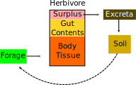

Large Herbivore Model {#page_herbiv_model}
==========================================
<!-- For doxygen, this is the *page* header -->
\brief Structure and scientific explanation of the Large Herbivore Model.

Large Herbivore Model {#sec_herbiv_model}
==========================================
<!-- For doxygen, this is the *section* header -->
\tableofcontents

<!--TODO:
- Limitations of the model design:
	+ year length of 365 assumed
	+ habitats equal size
	+ After offspring is created no connection to parents 
    -> no lactation, bonding, herding, etc.
-->

Basic Model Concepts {#sec_herbiv_basicconcepts}
------------------------------------------------

A herbivore is defined by these state variables:
- Age
- Sex
- Current energy need
- Fat mass

Plant–Herbivore Interaction {#sec_herbiv_plantherbivore_interactions}
---------------------------------------------------------------------

Each PFT can be mapped to a forage type:
@startuml "How plant functional types are mapped to forage types."
	!include herbiv_diagrams.iuml!default_pft_forage_type_mapping
@enduml

Through feeding, herbivores reduce aboveground plant biomass, i.e. carbon and nitrogen:

- The removed carbon from plant leaves is considered as a flux directly to the atmosphere (respiration).
  There is no intermediate decomposition of faeces or dead bodies in the soil.

- Nitrogen, on the other hand, moves in a closed cycle, it does not enter the atmosphere, but gets returned through excrements (and carcasses after death) directly to the plant-available soil pool.

<!-- Digestibility and C:N ratio are not coupled currently -->

### Feeding {#sec_herbiv_feeding}

### Nitrogen Excretion {#sec_herbiv_nitrogen_excretion}

Nitrogen uptake is calculated based on the C:N ratio of leaves.
The maximum amount of nitrogen (\f$N_{bound}\f$, kgN/km²) bound in herbivores is comprised of the body tissue and the contents of the digestive tract.
Any ingested nitrogen is added to the pool of herbivore-bound nitrogen, and the surplus is returned to the soil.

The amount of nitrogen bound in body tissue is approximated with 3% of live body weight (Robbins 1983\cite robbins1983wildlife); this ignores variation in fat and structural mass.
Upon death, this amount of nitrogen is also returned to the plant-available soil pool.

The nitrogen of ingesta in stomach and intestines depends on the mean retention time (\f$MRT\f$, hours) and the day’s intake of nitrogen (\f$I_N\f$, kgN/ind/day).
$$
N_{bound} = N_{guts} + N_{body} = I_N * MRT * P + 0.03 * M * P
$$
\f$P\f$ is the population density (ind/km²) and \f$M\f$ is the body mass (kg/ind).
Mean retention time in hours is calculated according to Clauss et al. (2007)\cite clauss2007case, Fig. 2:
$$
MRT = 32.8 * M^{0.07}
$$

### Trampling {#sec_herbiv_trampling}

Energetics {#sec_herbiv_energetics}
-----------------------------------

### Thermoregulation {#sec_herbiv_thermoregulation}

Homeothermic animals have extra energy costs to maintain their body core temperature.
Through basal metabolism and other ways of energy burning, heat is already passively created.
Thermoregulatory costs arise when the ambient temperature drops below the *lower critical temperature*: the passive heat from thermoneutral metabolism is not counterbalance heat loss to the environment.
The rate of heat loss depends on the *thermal conductance* of the whole animal (energy flow per temperature difference), which in turn depends on the *thermal conductivity* (energy flow per temperature difference and per thickness) of fur and skin and the body surface.

- \f$T_{crit}\f$: Lower critical temperature [°C].
- \f$T_{core}\f$: Body core temperature [°C].
- \f$T_{air}\f$: Ambient air temperature [°C].
- \f$E_{neu}\f$: Thermoneutral metabolic rate [MJ/ind/day]
- \f$C\f$: Whole-body thermal conductance [W/ind].
- \f$\Phi\f$: Heat loss [MJ/ind/day]
\f[
  T_{crit} = T_{core} - \frac{E_{neu}}{C}
\f]
\f[
  \Phi = C * max(T_{crit} - T_{air}, 0)
\f]

.")

\note In its current form, the model only considers costs when temperatures are too low.
Overheating effects are not implemented since the model was developed with the focus on Arctic megafauna.

#### Conductance

The critical parameter for thermoregulatory expenditure is the (whole-body) conductance: the rate of heat flow per difference between core and air temperature (W/°C).
The conductance can be approximated from the average conductivity and the body surface.
Conductivity is the inverse of insulation: it is the heat flow per temperature difference per area.

Body surface in m² scales roughly as \f$0.09*M^{0.66}\f$ ([Hudson & White 1985](\cite hudson1985bioenergetics)).

Energy Content of Forage {#sec_herbiv_energycontent}
----------------------------------------------------

\todo explain gross, digestible, metabolizable and net energy

Foraging {#sec_herbiv_foraging}
-------------------------------

\note **Units** All forage values (e.g. available grass biomass,
consumed forage) are *dry matter mass* in kilograms (`DMkg`).
Any forage per area (e.g. forage in a habitat) is `kgDM/km²`.
Herbivore-related mass values (e.g. body mass, fat mass) are also
`kg`, but live mass.
Population densities of herbivores are either in `kg/km²` or `ind/km²` (ind=individuals).

### Feeding on Plants in a Patch ### {#sec_herbiv_foraging_patch}

Each \ref Individual offers an amount of forage (kgDM/km²) that is available to herbivores (\ref Individual.get_forage_mass()).

<!-- TODO: explain some more -->

\todo Growth happens only once per year (\ref growth()) for natural vegetation.
However, seasonal shifts of forage availability are crucial for herbivore
dynamics.
A solution for that is yet to be found.

### Digestibility ### {#sec_herbiv_digestibility}
<!--
Everything: In vitro digestibility
Compare phenology digestibility with NPP-driven digestibility.

-->
Assumptions of the NPP-driven digestibility model (\ref Fauna::DigestibilityFromNPP):
- Constant proportion of NPP allocated to leaves.
- Linear decrease in forage quality.
- Turnover is constant over the year.
- Fraction of biomass older than 1 year is negligible.

Reproduction {#sec_herbiv_reproduction}
---------------------------------------

Life History {#sec_herbiv_life_history}
---------------------------------------

growth linear: \ref Fauna::HerbivoreBase::get_bodymass()

Mortality {#sec_herbiv_mortality}
---------------------------------

------------------------------------------------------------

\author Wolfgang Pappa, Senckenberg BiK-F
\date May 2017
\see \ref page_herbiv_design
\see \ref page_herbiv_tutor
\see \ref page_herbiv_tests
\see \ref group_herbivory
